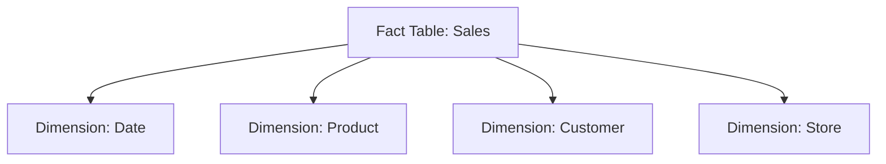
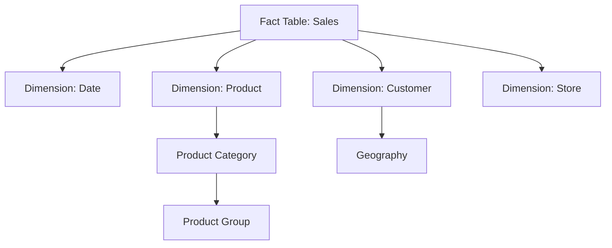

d# Data Modeling for Business Intelligence

Effective data modeling is crucial for successful Business Intelligence implementations. A well-designed data model makes complex data easier to understand, analyze, and visualize. This section covers key data modeling concepts and best practices for BI applications.

## What is Data Modeling?

Data modeling is the process of creating a conceptual representation of data objects, the relationships between them, and the rules that govern the data. For BI applications, data modeling focuses on organizing data in a way that supports efficient analysis and reporting.

## Types of Data Models

### Conceptual Data Models

Conceptual models provide a high-level overview of the business entities and their relationships:

- Focus on business concepts rather than technical implementation
- Used for communication with business stakeholders
- Show major entities and relationships without technical details

### Logical Data Models

Logical models add more detail to conceptual models:

- Define attributes for each entity
- Specify relationships and cardinality
- Remain independent of any specific database technology
- Include normalization rules

### Physical Data Models

Physical models implement the logical model in a specific database:

- Include database-specific elements like tables, columns, and data types
- Define indexes, constraints, and partitioning strategies
- Optimize for performance and storage requirements
- May include denormalization for query performance

## Data Modeling Approaches for BI

### Dimensional Modeling

Dimensional modeling is the most common approach for data warehousing and BI applications. It organizes data into:

- **Fact Tables**: Contain business metrics (measurements) and foreign keys to dimensions
- **Dimension Tables**: Contain descriptive attributes that provide context for facts

Key concepts in dimensional modeling include:

#### Star Schema

A star schema is the simplest form of dimensional model:

- One central fact table connected to multiple dimension tables
- Simple, intuitive structure for business users
- Optimized for read-heavy analytics workloads

#### Snowflake Schema

A snowflake schema extends the star schema by normalizing dimension tables:

- Dimensions are split into multiple related tables
- Reduces data redundancy
- More complex queries compared to star schema

#### Conformed Dimensions

Conformed dimensions are shared across multiple fact tables:

- Enable consistent analysis across different business processes
- Support enterprise-wide reporting
- Maintain a "single version of the truth"

### Data Vault Modeling

Data Vault is an alternative approach designed for enterprise data warehousing:

- **Hubs**: Contain business keys for core business entities
- **Links**: Define relationships between hubs
- **Satellites**: Store descriptive attributes and historical changes
- Highly adaptable to changing business requirements
- Good for historical tracking and auditability

### Third Normal Form (3NF)

Some BI implementations use normalized models:

- Minimizes data redundancy
- Better for transactional systems or operational data stores
- May require more complex queries for analytics

## Data Modeling for Snowflake

Snowflake's architecture offers unique considerations for data modeling:

- **Columnar Storage**: Optimizes for column-based access patterns typical in analytics
- **Separation of Storage and Compute**: Allows for more flexible modeling approaches
- **Zero-Copy Cloning**: Enables creating development versions of data models
- **Time Travel**: Simplifies historical analysis and point-in-time reporting

### Snowflake-Specific Best Practices

When modeling data in Snowflake:

1. **Leverage Semi-Structured Data**: Use VARIANT columns for JSON, XML, and other semi-structured data
2. **Consider Clustering Keys**: Define clustering keys based on common query patterns
3. **Use Materialized Views**: For frequently accessed derived datasets
4. **Embrace ELT Over ETL**: Load raw data first, then transform within Snowflake
5. **Implement Multi-Table INSERT**: For efficient data transformation pipelines

## Integrating Marketplace Data into Your Data Model

When incorporating Snowflake Marketplace data:

1. **Document External Sources**: Clearly identify marketplace data in your model
2. **Create Integration Layers**: Build views that combine internal and marketplace data
3. **Consider Refresh Patterns**: Understand how often marketplace data is updated
4. **Map Common Keys**: Identify keys that link marketplace data to internal data
5. **Implement Data Quality Checks**: Validate marketplace data before integration

## Data Modeling Tools

Popular tools for data modeling in BI projects include:

- **dbt (data build tool)**: For transformation and modeling in modern data warehouses
- **Lucidchart**: For conceptual and logical data modeling
- **ERwin**: Enterprise data modeling platform
- **ER/Studio**: Database design and data architecture tools
- **Snowflake's Native SQL**: For implementing physical models

## Data Modeling Principles

Regardless of your chosen approach, follow these principles:

1. **Business-Driven Design**: Start with business requirements, not technical constraints
2. **Simplicity**: Keep models as simple as possible while meeting requirements
3. **Flexibility**: Design models to accommodate future changes
4. **Performance**: Optimize for the most common query patterns
5. **Consistency**: Use consistent naming conventions and structures
6. **Documentation**: Thoroughly document your data model for all stakeholders

## Common Challenges and Solutions

### Slowly Changing Dimensions (SCDs)

Handling attributes that change over time:

- **Type 1**: Overwrite old values (no history)
- **Type 2**: Add new rows for changes (preserves history)
- **Type 3**: Add new columns for previous values (limited history)
- **Type 4**: Use history tables (separate historical tracking)
- **Type 6**: Combine Types 1, 2, and 3 (hybrid approach)

### Handling Large Fact Tables

Strategies for managing large volumes of fact data:

- **Partitioning**: Divide tables based on time or other attributes
- **Aggregation**: Create summary tables for common analyses
- **Data Lifecycle Management**: Archive or delete older, less relevant data

### Balancing Normalization and Denormalization

Finding the right balance for your specific use case:

- More normalization: Better for data integrity and maintenance
- More denormalization: Better for query performance and user understanding

!!! info "Next Steps"
    Continue to [Data Visualization](data-visualization.md) to learn how to effectively present the insights from your data models.
